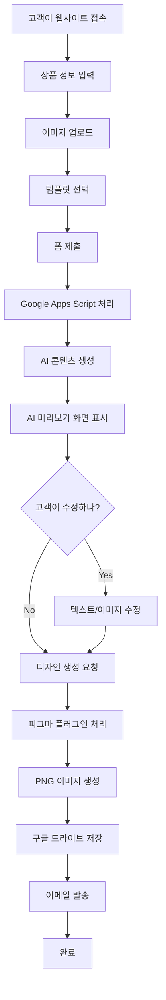

# 🎨 상세페이지 자동 생성 시스템 v2.0

웹사이트 UI를 통해 고객이 직접 텍스트와 이미지를 입력하면, AI가 콘텐츠를 생성하고 피그마 템플릿을 자동으로 수정하여 상세페이지를 만드는 시스템입니다.

## ✨ 새로운 기능 (v2.0)

### 🤖 AI 미리보기 및 수정 기능
- AI가 생성한 콘텐츠를 실시간으로 미리보기
- 텍스트 내용을 자유롭게 수정 가능
- 이미지 재업로드 기능
- 수정된 내용으로 최종 디자인 생성

### 🌐 웹앱-피그마 플러그인 연동
- 웹앱에서 수정된 내용이 피그마 플러그인으로 자동 전송
- 피그마 플러그인에서 "웹앱 디자인 처리" 버튼으로 일괄 처리
- 실시간 상태 확인 및 완료 알림

## 📋 시스템 구성

### 1. 웹사이트 UI (`web-ui.html`)
- 고객이 직접 사용하는 인터페이스
- 텍스트 입력, 이미지 업로드, 템플릿 선택 기능
- **AI 미리보기 및 수정 기능**
- 반응형 디자인으로 모바일/데스크톱 모두 지원

### 2. Google Apps Script 웹앱 서버 (`web-app-server.gs`)
- 웹폼 데이터 처리
- OpenAI API를 통한 AI 콘텐츠 생성
- **AI 미리보기 응답 및 수정된 내용 저장**
- 피그마 API 연동 및 이미지 생성
- 구글 드라이브 저장 및 이메일 발송
- **피그마 플러그인과의 실시간 연동**

### 3. 피그마 플러그인 (`figma-plugin/`)
- 템플릿 자동 인식
- 텍스트 및 이미지 자동 업데이트
- **웹앱 연동 기능**
- 고품질 PNG 내보내기

## 🚀 설치 및 설정

### 1단계: Google Apps Script 설정

1. [Google Apps Script](https://script.google.com)에 접속
2. 새 프로젝트 생성
3. `web-app-server.gs` 파일의 내용을 복사하여 붙여넣기
4. 다음 API 키들을 설정:

```javascript
function setupWebAppAPIKeys() {
  const scriptProperties = PropertiesService.getScriptProperties();
  
  scriptProperties.setProperties({
    'OPENAI_API_KEY': 'your-openai-api-key-here',
    'FIGMA_FILE_KEY': 'your-default-figma-file-key-here',
    'FIGMA_TEMPLATE_MINIMAL': 'your-minimal-template-key-here',
    'FIGMA_TEMPLATE_MODERN': 'your-modern-template-key-here',
    'FIGMA_TEMPLATE_LUXURY': 'your-luxury-template-key-here',
    'FIGMA_ACCESS_TOKEN': 'your-figma-access-token-here'
  });
}
```

5. `setupWebAppAPIKeys()` 함수 실행하여 API 키 설정
6. 웹앱으로 배포:
   - 배포 > 새 배포
   - 유형: 웹앱
   - 실행: 나
   - 액세스 권한: 모든 사용자
7. 배포 URL 복사

### 2단계: 웹사이트 설정

1. `web-ui.html` 파일을 웹 서버에 업로드
2. 파일 내의 `YOUR_SCRIPT_ID` 부분을 Google Apps Script 배포 URL로 교체:

```javascript
const response = await fetch('https://script.google.com/macros/s/YOUR_ACTUAL_SCRIPT_ID/exec', {
  method: 'POST',
  body: formData
});
```

### 3단계: 피그마 플러그인 설정

1. 피그마에서 플러그인 개발 모드 활성화
2. `figma-plugin/` 폴더의 파일들을 업로드
3. 플러그인 테스트 및 배포

### 4단계: 피그마 템플릿 준비

각 템플릿 파일에서 다음 노드명을 사용하세요:

#### 미니멀 템플릿
- 텍스트 노드: `productName`, `content`
- 이미지 노드: `productImage`

#### 모던 템플릿
- 텍스트 노드: `productName`, `content`, `subtitle`, `price`
- 이미지 노드: `productImage`, `heroImage`

#### 럭셔리 템플릿
- 텍스트 노드: `productName`, `content`, `subtitle`, `price`, `tagline`
- 이미지 노드: `productImage`, `heroImage`, `luxuryImage`

## 🔧 API 키 획득 방법

### OpenAI API Key
1. [OpenAI Platform](https://platform.openai.com) 접속
2. 계정 생성 및 로그인
3. API Keys 메뉴에서 새 키 생성
4. 생성된 키를 `OPENAI_API_KEY`에 설정

### Figma Access Token
1. [Figma](https://figma.com) 로그인
2. 설정 > Account > Personal Access Tokens
3. 새 토큰 생성
4. 생성된 토큰을 `FIGMA_ACCESS_TOKEN`에 설정

### Figma File Key
1. 피그마 파일 URL에서 파일 키 추출
2. 예: `https://www.figma.com/file/ABC123DEF456/...` → `ABC123DEF456`
3. 각 템플릿별로 파일 키를 설정

## 📱 사용법

### 고객 사용법 (v2.0)
1. 웹사이트에 접속
2. 상품명과 설명 입력
3. 상품 이미지 업로드 (선택사항)
4. 원하는 템플릿 선택
5. 이메일 주소 입력
6. "상세페이지 생성하기" 버튼 클릭
7. **AI가 생성한 콘텐츠 미리보기 확인**
8. **텍스트 내용 수정 (선택사항)**
9. **이미지 재업로드 (선택사항)**
10. **"이 내용으로 디자인 생성하기" 버튼 클릭**
11. 완성된 파일을 이메일로 받기

### 관리자 사용법
1. Google Sheets에서 요청 현황 확인
2. **피그마 플러그인에서 "웹앱 디자인 처리" 버튼으로 일괄 처리**
3. 구글 드라이브에서 완성본 관리

## 🎯 주요 기능

### 웹사이트 UI
- ✅ 반응형 디자인
- ✅ 드래그 앤 드롭 이미지 업로드
- ✅ 실시간 폼 검증
- ✅ 로딩 상태 표시
- ✅ 에러 처리 및 사용자 피드백
- ✅ **AI 콘텐츠 미리보기 및 수정**
- ✅ **이미지 재업로드 기능**
- ✅ **실시간 텍스트 미리보기**

### Google Apps Script
- ✅ AI 콘텐츠 자동 생성
- ✅ 피그마 API 연동
- ✅ 구글 드라이브 자동 저장
- ✅ 이메일 자동 발송
- ✅ 에러 처리 및 로깅
- ✅ **웹앱-피그마 플러그인 연동**
- ✅ **수정된 콘텐츠 우선 처리**

### 피그마 플러그인
- ✅ 템플릿 자동 인식
- ✅ 텍스트 노드 자동 매핑
- ✅ 이미지 자동 업데이트
- ✅ 고품질 PNG 내보내기
- ✅ 페이지 분석 기능
- ✅ **웹앱 연동 기능**
- ✅ **일괄 디자인 처리**

## 🔄 워크플로우 (v2.0)



## 🛠️ 커스터마이징

### 템플릿 추가
1. 새로운 피그마 템플릿 파일 생성
2. `getNodeMapping()` 함수에 새 템플릿 추가
3. `getTemplateFileKey()` 함수에 파일 키 설정
4. 웹 UI에 새 템플릿 옵션 추가

### AI 프롬프트 수정
`generateAIContent()` 함수의 프롬프트를 수정하여 원하는 스타일의 콘텐츠 생성 가능

### 이메일 템플릿 수정
`sendCompletionEmail()` 함수에서 이메일 내용 수정 가능

## 🐛 문제 해결

### 일반적인 문제들

1. **API 키 오류**
   - 스크립트 속성에서 API 키 확인
   - API 키 권한 및 만료일 확인

2. **피그마 파일 접근 오류**
   - 파일 공유 권한 확인
   - 파일 키 정확성 확인

3. **이미지 업로드 실패**
   - 파일 크기 제한 확인 (10MB 이하)
   - 지원 형식 확인 (JPG, PNG)

4. **이메일 발송 실패**
   - Gmail API 권한 확인
   - 일일 발송 한도 확인

### 로그 확인
Google Apps Script 에디터의 실행 로그에서 상세한 오류 정보 확인 가능

## 📈 성능 최적화

### 권장사항
- 이미지 크기 최적화 (웹용으로 압축)
- 피그마 템플릿 파일 크기 최소화
- API 호출 빈도 제한 고려
- 캐싱 전략 구현

## 🔒 보안 고려사항

- API 키는 환경변수로 관리
- 사용자 입력 데이터 검증
- 파일 업로드 보안 검사
- HTTPS 사용 권장

## 🆕 v2.0 새로운 기능 상세 설명

### 🤖 AI 미리보기 및 수정 기능

#### 작동 방식
1. **AI 콘텐츠 생성**: 고객이 입력한 정보를 바탕으로 OpenAI가 상세페이지 설명을 자동 생성
2. **미리보기 화면**: 생성된 콘텐츠를 실시간으로 미리보기할 수 있는 화면 표시
3. **수정 기능**: 
   - 텍스트 내용을 자유롭게 편집 가능
   - 이미지 재업로드 기능
   - 실시간 미리보기로 수정 내용 확인
4. **최종 생성**: 수정된 내용으로 피그마 디자인 생성

#### 기술 구현
- **프론트엔드**: JavaScript로 실시간 텍스트 편집 및 미리보기
- **백엔드**: Google Apps Script에서 수정된 내용을 별도 컬럼에 저장
- **데이터 흐름**: AI 생성글(E열) → 고객수정글(F열) → 최종 디자인

### 🌐 웹앱-피그마 플러그인 연동

#### 작동 방식
1. **웹앱에서 수정 완료**: 고객이 수정한 내용이 Google Sheets에 저장
2. **피그마 플러그인 연동**: 플러그인에서 "웹앱 디자인 처리" 버튼 클릭
3. **자동 처리**: 웹앱 서버에서 대기 중인 디자인 요청을 가져와서 일괄 처리
4. **완료 알림**: 처리 완료 후 웹앱 서버에 상태 업데이트

#### 기술 구현
- **API 연동**: 피그마 플러그인에서 Google Apps Script 웹앱 API 호출
- **데이터 동기화**: 실시간으로 디자인 요청 상태 확인
- **일괄 처리**: 여러 디자인 요청을 한 번에 처리하여 효율성 향상

### 📊 데이터 구조 (v2.0)

#### Google Sheets 컬럼 구조
- **A열**: 타임스탬프
- **B열**: 고객 이메일
- **C열**: 상품명
- **D열**: 키워드
- **E열**: AI 생성글 (기존)
- **F열**: 고객수정글 (신규)
- **G열**: Figma 링크
- **H열**: PNG 링크
- **I열**: 상태 (AI생성완료 → 디자인생성중 → 완료)
- **J열**: 세션 ID (신규)
- **K열**: 이미지 데이터 (신규)

#### 상태 관리
- `AI생성완료`: AI 콘텐츠 생성 완료, 고객 검수 대기
- `디자인생성중`: 고객 수정 완료, 피그마 디자인 생성 중
- `완료`: 모든 작업 완료

## 📞 지원

문제가 발생하거나 추가 기능이 필요한 경우:
1. GitHub Issues 등록
2. 로그 파일 첨부
3. 재현 단계 상세 설명

---

**🎉 v2.0으로 고객이 AI 생성 콘텐츠를 미리보기하고 수정할 수 있는 완전 자동화 시스템이 완성되었습니다!**
